# BeanMora — Database schema, ERD & RLS matrix

Full source of truth: `supabase/migrations/*.sql` (17 migrations, applied in
order, idempotent extension/function setup). This doc summarizes it for
review — if the two disagree, the SQL wins.

Migrations 01–11 are the Phase 1 app foundation (profiles, roasters, beans,
recipes, community, xBloom stub). Migrations 12–17 are Phase 2: they add a
GCC-wide coffee-data model (countries/cities/roaster geography, a
Coffee-Lot-vs-Roasted-Product split, provenance/trust tracking on every
sourced fact, reviews split from "confirmed I brewed it" attempts, personal
inventory, and an admin research/import/duplicate-detection pipeline). See
`## 6. Phase 2 — GCC data model` below.

## 1. Entity relationship overview

```mermaid
erDiagram
  profiles ||--o{ user_equipment : owns
  profiles ||--|| user_preferences : has
  profiles ||--o{ user_roles : holds
  profiles ||--o{ recipes : authors
  profiles ||--o{ beans : "adds (created_by)"
  profiles ||--o{ roasters : "owns (optional)"
  profiles ||--o{ brew_logs : logs
  profiles ||--o{ posts : authors
  profiles ||--o{ comments : writes
  profiles ||--o{ follows : "follower/following"
  profiles ||--o{ recipe_collections : curates
  profiles ||--o{ xbloom_devices : registers

  roasters ||--o{ beans : roasts
  beans ||--o{ bean_images : has
  beans ||--o{ bean_flavor_notes : has
  beans ||--o{ recipes : "used in"
  beans ||--o{ brew_logs : "used in"

  brew_methods ||--o{ recipes : categorizes
  brew_methods ||--o{ brew_logs : categorizes

  recipes ||--o{ recipe_steps : has
  recipes ||--o{ recipe_pours : has
  recipes ||--o{ recipe_equipment : requires
  recipes ||--o{ recipe_images : has
  recipes ||--o{ recipe_versions : "history of"
  recipes ||--o{ recipe_ratings : "rated by"
  recipes ||--o{ recipe_saves : "saved by"
  recipes ||--o{ recipe_collection_items : "listed in"
  recipes ||--o| xbloom_recipe_profiles : "has xBloom settings"
  recipes ||--o{ xbloom_sync_jobs : "queued for"
  recipes ||--o{ comments : "commented on"
  recipes ||--o{ brew_logs : "brewed via"

  recipe_collections ||--o{ recipe_collection_items : contains

  posts ||--o{ post_media : has
  posts ||--o{ post_likes : "liked by"
  posts ||--o{ comments : "commented on"
  posts ||--o{ recipes : "optionally links"

  comments ||--o{ comments : "replies to"
  comments ||--o{ comment_likes : "liked by"

  brew_logs ||--|| brew_log_taste_scores : scores

  equipment_brands ||--o{ equipment_models : makes
  equipment_models ||--o{ user_equipment : "instance of"
  equipment_models ||--o{ recipe_equipment : "used in"

  profiles ||--o{ reports : files
  profiles ||--o{ blocks : "blocker/blocked"
  profiles ||--o{ moderation_actions : "acted by (moderator)"
  profiles ||--o{ notifications : receives
  profiles ||--o{ integration_connections : has
  profiles ||--o{ audit_logs : "acted by (actor)"
```



## 2. Table list (62 tables, grouped by migration)

| Migration | Tables |
|---|---|
| 02 | `profiles`, `user_roles`, `user_preferences` |
| 03 | `brew_methods`, `equipment_brands`, `equipment_models`, `user_equipment` |
| 04 | `roasters`, `beans`, `bean_images`, `bean_flavor_notes` |
| 05 | `recipes`, `recipe_steps`, `recipe_pours`, `recipe_equipment`, `recipe_images`, `recipe_versions` |
| 06 | `recipe_ratings`, `recipe_collections`, `recipe_collection_items`, `recipe_saves` |
| 07 | `brew_logs`, `brew_log_taste_scores` |
| 08 | `follows`, `posts`, `post_media`, `post_likes`, `comments`, `comment_likes` |
| 09 | `notifications`, `reports`, `blocks`, `moderation_actions` |
| 10 | `xbloom_devices`, `xbloom_recipe_profiles`, `xbloom_sync_jobs`, `integration_connections`, `audit_logs` |
| 12 | `countries`, `cities`, `roaster_locations`, `roaster_shipping_countries` (+ geo columns added to `roasters`) |
| 13 | `coffee_lots`, `roasted_products`, `product_prices`, `product_availability`, `product_sources`, `product_images` |
| 14 | `recipe_sources`, `recipe_verifications` (+ provenance/type/visibility columns added to `recipes`) |
| 15 | `bean_reviews`, `recipe_attempts`, `recipe_reviews` (+ `recipe_score()` function) |
| 16 | `user_bean_inventory`, `brew_log_adjustments` |
| 17 | `data_import_jobs`, `data_import_rows`, `research_jobs`, `research_sources`, `duplicate_candidates`, `roaster_claims`, `data_correction_requests` |

Conventions applied everywhere: UUID primary keys (`gen_random_uuid()`),
`created_at`/`updated_at` with a shared `set_updated_at()` trigger, foreign
keys with an explicit `on delete` behavior, `check` constraints for enum-like
text columns, indexes on every foreign key and filter/sort column, unique
constraints for one-per-user relationships (ratings, saves, follows, likes).
Multilingual official content (`beans`, `roasters`) carries `name_ar` /
`name_en` / `description_ar` / `description_en`. User-generated content
(`recipes`, `posts`, `comments`) carries a single `content_language` column
instead — we show the original text, never a silent machine translation.

## 3. RLS policy matrix

RLS is enabled on every table above plus `storage.objects`. Summary (see
migration files for exact `USING`/`WITH CHECK` clauses):

| Table family | SELECT | INSERT | UPDATE | DELETE |
|---|---|---|---|---|
| `profiles` | public | self only | self only | — |
| `user_roles` | self + admin | admin only | — | admin only |
| `user_preferences`, `user_equipment` | self only | self only | self only | self only |
| `roasters` | public | admin | owner or admin | admin |
| `beans`, `bean_images`, `bean_flavor_notes` | published, or creator/admin | authenticated (creator) | creator or admin | admin |
| `recipes` + children (steps/pours/equipment/images/versions) | `visibility='public'`, or owner/admin | owner only | owner only | owner or admin |
| `recipe_ratings` | follows parent recipe visibility | authenticated, 1/user (unique) | self only | self or admin |
| `recipe_collections`, `recipe_collection_items` | owner, or public collections | owner only | owner only | owner only |
| `recipe_saves` | self only | self only | — | self only |
| `brew_logs`, `brew_log_taste_scores` | self only (never shown to others) | self only | self only | self only |
| `posts`, `post_media` | public+not-hidden, or owner/mod/admin | authenticated (owner) | owner or mod/admin | owner or admin |
| `post_likes`, `comment_likes`, `follows` | public | authenticated (self) | — | self only |
| `comments` | follows parent recipe/post visibility | authenticated (owner) | owner or mod/admin | owner or admin |
| `notifications` | self only | server-only (no client policy) | self only (mark read) | self only |
| `reports` | reporter + mod/admin | authenticated (reporter) | mod/admin only | — |
| `blocks` | self only | self only | — | self only |
| `moderation_actions`, `audit_logs` | admin (+moderator for the former) | server-only | — | — |
| `xbloom_devices` | self only | self only | self only | self only |
| `xbloom_recipe_profiles` | follows parent recipe visibility | owner only | owner only | owner only |
| `xbloom_sync_jobs` | self only | server-only | server-only | — |
| `integration_connections` | **nobody via client** (service_role only) | server-only | server-only | server-only |

Role checks use `private.has_role(role text)` — a `SECURITY DEFINER` SQL
function reading `user_roles`, kept in a non-exposed `private` schema so it
can never be called directly as a PostgREST RPC, never
`auth.users.raw_user_meta_data` / `user_metadata` (which is user-editable and
unsafe for authorization). See migration 02 for the full rationale (this was
originally defined in migration 01 and had to be moved after a real
`supabase db push` failed with a forward-reference error — `user_roles`
didn't exist yet when the function body was catalog-validated).

## 4. Storage buckets

| Bucket | Public read | Write path convention |
|---|---|---|
| `avatars` | yes | `{user_id}/...` |
| `bean-images` | yes | `{user_id}/{bean_id}/...` |
| `recipe-images` | yes | `{user_id}/{recipe_id}/...` |
| `recipe-videos` | yes | `{user_id}/{recipe_id}/...` |
| `roaster-logos` | yes | `{user_id}/{roaster_id}/...` |
| `post-media` | yes | `{user_id}/{post_id}/...` |

Every bucket has a `file_size_limit` and `allowed_mime_types` set at the
bucket level (see migration 11), in addition to client-side validation
before upload.

## 5. Applying migrations

```bash
npx supabase login
npx supabase link --project-ref ubvzdglrwkkuaigmkjap
npx supabase db push          # applies supabase/migrations/*.sql in order
psql "$DATABASE_URL" -f supabase/seed/brew_methods.sql   # reference data only
```

After migrations are applied, regenerate types:

```bash
npx supabase gen types typescript --project-id ubvzdglrwkkuaigmkjap > src/lib/supabase/types.ts
```

## 6. Phase 2 — GCC data model

### 6.1 Coffee Lot vs Roasted Product

`coffee_lots` (the origin: country/region/farm/varietal/process/altitude) and
`roasted_products` (what a specific roaster actually sells: a lot roasted
under a name, at a roast level, in given bag sizes) are deliberately separate
tables, joined by `roasted_products.coffee_lot_id`. Two roasters selling the
same Yirgacheffe lot are two `roasted_products` rows pointing at the *same*
`coffee_lots` row — never merged into one product, and never treated as
duplicates of each other (see `duplicate-detection.ts` — cross-roaster
comparisons short-circuit to "not a duplicate" by design, since a shared
origin lot across two independent roasters is normal, not a data error).

`roasted_products.legacy_bean_id` is a nullable bridge FK back to Phase 1's
`beans` table, added instead of dropping/renaming `beans`, since no
production data exists yet and migrations 04/05 were only just hand-fixed
from the user's own `db push` bug reports — churning them again wasn't worth
the risk.

### 6.2 Provenance / trust model

Every sourced-data table (`roasters`, `coffee_lots`, `roasted_products`,
`product_prices`, `product_availability`, `recipes` via `recipe_sources`)
carries: `source_type`, `source_url`, `source_name`, `last_verified_at`,
`verified_by`, `data_confidence` (`official` / `verified` /
`community_submitted` / `suggested` / `unverified`), `requires_review`. The
UI must never hide or downplay a low-confidence value — see
`roasters/[slug]/page.tsx` for the reference pattern (a `data_confidence`
badge rendered next to the roaster name).

### 6.3 Recipe Score (migration 15)

`public.recipe_score(recipe_id uuid)` is computed at query time, not stored,
combining: attempt volume (log-scaled, capped), average review rating,
confirmed-attempt success rate, source-data completeness, and a recipe-type
weight (`official_roaster` > `verified_barista` > `community` > `personal` >
`suggested`). This is intentional — the formula is designed so one 5-star
rating on a brand-new recipe cannot outrank a recipe with hundreds of
successful confirmed attempts, per the product requirement that popularity
and reliability must both matter.

`recipe_attempts` gates `recipe_reviews`: a user must have a recorded attempt
(a "yes I actually brewed this" confirmation) before they can review a
recipe, separate from the lighter-weight `recipe_ratings` quick-rate flow
kept from Phase 1.

### 6.4 Duplicate detection (never auto-merge)

`duplicate_candidates` (migration 17) stores suggested matches; nothing in
the schema or application code executes a merge automatically — an admin
must review and approve. The scoring logic lives in
`src/lib/duplicate-detection.ts` (unit tested in
`src/lib/__tests__/duplicate-detection.test.ts`):
`coffeeLotSimilarity()` is a weighted field comparison (origin country/region/
farm/varietal/process) for candidate lot merges, and
`roastedProductSimilarity()` returns `null` (never a candidate) whenever two
products belong to different roasters. `suggestAction()` maps a similarity
score to `merge` (≥0.85, still admin-reviewed) / `needs_review` (≥0.5) /
`keep_separate`.

### 6.5 Admin data pipeline (migration 17)

`data_import_jobs` / `data_import_rows` back the CSV/Excel/JSON import flow
required by the spec: every import is previewed (new / duplicate /
missing-fields / invalid-image / broken-link / conflict rows shown before
anything is written) and nothing reaches production tables without an admin
approving the preview — there is no auto-import path anywhere in this schema.
`research_jobs` / `research_sources` log per-country research runs (see
`supabase/research/kuwait/` for the Wave 1 Kuwait output and methodology).
`roaster_claims` and `data_correction_requests` are open to any authenticated
user to submit, but require moderator/admin action to take effect.

### 6.6 RLS pattern for Phase 2 tables

Same conventions as section 3: publicly-readable reference/product data
(`countries`, `cities`, `coffee_lots`, `roasted_products`, `product_prices`,
`product_availability`), owner-or-admin-write for roaster-linked data,
strict self-only RLS for `user_bean_inventory` (never admin-readable without
a documented legal/security cause, matching the same rule applied to private
recipes), and admin/moderator-only for every table in the data pipeline
(`data_import_jobs`, `research_jobs`, `duplicate_candidates`, etc.) except
the two open-submission tables noted above.
