# BeanMora — Database schema, ERD & RLS matrix

Full source of truth: `supabase/migrations/*.sql` (11 migrations, applied in
order, idempotent extension/function setup). This doc summarizes it for
review — if the two disagree, the SQL wins.

## 1. Entity relationship overview

```mermaid
erDiagram
  profiles ||--o{ user_equipment : owns
  profiles ||--|| user_preferences : has
  profiles ||--o{ user_roles : holds
  profiles ||--o{ recipes : authors
  profiles ||--o{ beans : "adds (created_by)"
  profiles ||--o{ roasters : "owns (optional)"
  profiles ||--o{ brew_logs : logs
  profiles ||--o{ posts : authors
  profiles ||--o{ comments : writes
  profiles ||--o{ follows : "follower/following"
  profiles ||--o{ recipe_collections : curates
  profiles ||--o{ xbloom_devices : registers

  roasters ||--o{ beans : roasts
  beans ||--o{ bean_images : has
  beans ||--o{ bean_flavor_notes : has
  beans ||--o{ recipes : "used in"
  beans ||--o{ brew_logs : "used in"

  brew_methods ||--o{ recipes : categorizes
  brew_methods ||--o{ brew_logs : categorizes

  recipes ||--o{ recipe_steps : has
  recipes ||--o{ recipe_pours : has
  recipes ||--o{ recipe_equipment : requires
  recipes ||--o{ recipe_images : has
  recipes ||--o{ recipe_versions : "history of"
  recipes ||--o{ recipe_ratings : "rated by"
  recipes ||--o{ recipe_saves : "saved by"
  recipes ||--o{ recipe_collection_items : "listed in"
  recipes ||--o| xbloom_recipe_profiles : "has xBloom settings"
  recipes ||--o{ xbloom_sync_jobs : "queued for"
  recipes ||--o{ comments : "commented on"
  recipes ||--o{ brew_logs : "brewed via"

  recipe_collections ||--o{ recipe_collection_items : contains

  posts ||--o{ post_media : has
  posts ||--o{ post_likes : "liked by"
  posts ||--o{ comments : "commented on"
  posts ||--o{ recipes : "optionally links"

  comments ||--o{ comments : "replies to"
  comments ||--o{ comment_likes : "liked by"

  brew_logs ||--|| brew_log_taste_scores : scores

  equipment_brands ||--o{ equipment_models : makes
  equipment_models ||--o{ user_equipment : "instance of"
  equipment_models ||--o{ recipe_equipment : "used in"

  profiles ||--o{ reports : files
  profiles ||--o{ blocks : "blocker/blocked"
  profiles ||--o{ moderation_actions : "acted by (moderator)"
  profiles ||--o{ notifications : receives
  profiles ||--o{ integration_connections : has
  profiles ||--o{ audit_logs : "acted by (actor)"
```



## 2. Table list (38 tables, grouped by migration)

| Migration | Tables |
|---|---|
| 02 | `profiles`, `user_roles`, `user_preferences` |
| 03 | `brew_methods`, `equipment_brands`, `equipment_models`, `user_equipment` |
| 04 | `roasters`, `beans`, `bean_images`, `bean_flavor_notes` |
| 05 | `recipes`, `recipe_steps`, `recipe_pours`, `recipe_equipment`, `recipe_images`, `recipe_versions` |
| 06 | `recipe_ratings`, `recipe_collections`, `recipe_collection_items`, `recipe_saves` |
| 07 | `brew_logs`, `brew_log_taste_scores` |
| 08 | `follows`, `posts`, `post_media`, `post_likes`, `comments`, `comment_likes` |
| 09 | `notifications`, `reports`, `blocks`, `moderation_actions` |
| 10 | `xbloom_devices`, `xbloom_recipe_profiles`, `xbloom_sync_jobs`, `integration_connections`, `audit_logs` |

Conventions applied everywhere: UUID primary keys (`gen_random_uuid()`),
`created_at`/`updated_at` with a shared `set_updated_at()` trigger, foreign
keys with an explicit `on delete` behavior, `check` constraints for enum-like
text columns, indexes on every foreign key and filter/sort column, unique
constraints for one-per-user relationships (ratings, saves, follows, likes).
Multilingual official content (`beans`, `roasters`) carries `name_ar` /
`name_en` / `description_ar` / `description_en`. User-generated content
(`recipes`, `posts`, `comments`) carries a single `content_language` column
instead — we show the original text, never a silent machine translation.

## 3. RLS policy matrix

RLS is enabled on every table above plus `storage.objects`. Summary (see
migration files for exact `USING`/`WITH CHECK` clauses):

| Table family | SELECT | INSERT | UPDATE | DELETE |
|---|---|---|---|---|
| `profiles` | public | self only | self only | — |
| `user_roles` | self + admin | admin only | — | admin only |
| `user_preferences`, `user_equipment` | self only | self only | self only | self only |
| `roasters` | public | admin | owner or admin | admin |
| `beans`, `bean_images`, `bean_flavor_notes` | published, or creator/admin | authenticated (creator) | creator or admin | admin |
| `recipes` + children (steps/pours/equipment/images/versions) | `visibility='public'`, or owner/admin | owner only | owner only | owner or admin |
| `recipe_ratings` | follows parent recipe visibility | authenticated, 1/user (unique) | self only | self or admin |
| `recipe_collections`, `recipe_collection_items` | owner, or public collections | owner only | owner only | owner only |
| `recipe_saves` | self only | self only | — | self only |
| `brew_logs`, `brew_log_taste_scores` | self only (never shown to others) | self only | self only | self only |
| `posts`, `post_media` | public+not-hidden, or owner/mod/admin | authenticated (owner) | owner or mod/admin | owner or admin |
| `post_likes`, `comment_likes`, `follows` | public | authenticated (self) | — | self only |
| `comments` | follows parent recipe/post visibility | authenticated (owner) | owner or mod/admin | owner or admin |
| `notifications` | self only | server-only (no client policy) | self only (mark read) | self only |
| `reports` | reporter + mod/admin | authenticated (reporter) | mod/admin only | — |
| `blocks` | self only | self only | — | self only |
| `moderation_actions`, `audit_logs` | admin (+moderator for the former) | server-only | — | — |
| `xbloom_devices` | self only | self only | self only | self only |
| `xbloom_recipe_profiles` | follows parent recipe visibility | owner only | owner only | owner only |
| `xbloom_sync_jobs` | self only | server-only | server-only | — |
| `integration_connections` | **nobody via client** (service_role only) | server-only | server-only | server-only |

Role checks use `public.has_role(role text)` — a `SECURITY DEFINER` SQL
function reading `user_roles`, never `auth.users.raw_user_meta_data` /
`user_metadata` (which is user-editable and unsafe for authorization).

## 4. Storage buckets

| Bucket | Public read | Write path convention |
|---|---|---|
| `avatars` | yes | `{user_id}/...` |
| `bean-images` | yes | `{user_id}/{bean_id}/...` |
| `recipe-images` | yes | `{user_id}/{recipe_id}/...` |
| `recipe-videos` | yes | `{user_id}/{recipe_id}/...` |
| `roaster-logos` | yes | `{user_id}/{roaster_id}/...` |
| `post-media` | yes | `{user_id}/{post_id}/...` |

Every bucket has a `file_size_limit` and `allowed_mime_types` set at the
bucket level (see migration 11), in addition to client-side validation
before upload.

## 5. Applying migrations

```bash
npx supabase login
npx supabase link --project-ref ubvzdglrwkkuaigmkjap
npx supabase db push          # applies supabase/migrations/*.sql in order
psql "$DATABASE_URL" -f supabase/seed/brew_methods.sql   # reference data only
```

After migrations are applied, regenerate types:

```bash
npx supabase gen types typescript --project-id ubvzdglrwkkuaigmkjap > src/lib/supabase/types.ts
```
