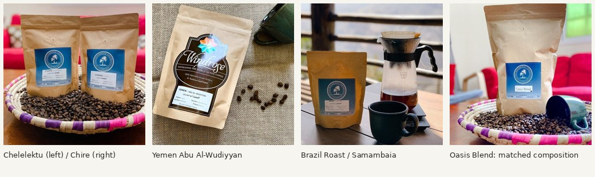

# Coffee catalog media audit — 2026-10-04

This folder preserves the compact media audit, original 137 repair replay and final verification of **214 published, reviewed BeanMora beans** in Supabase project `ubvzdglrwkkuaigmkjap`: the original 137 plus 77 canonical imports. No private user records were read. The audit agent made no production mutations.

## Final catalog: applied and verified

A read-only production query at **2026-10-04 16:24:19.371181 UTC** verified the full catalog after all 77 new bean rows were applied. Every expected bean is present, published and reviewed; no other public reviewed bean lies outside the audited 214-record scope.

| Final catalog measure | Actual result |
| --- | ---: |
| Public, reviewed beans | **214** |
| Original audited beans | 137 |
| Canonical new beans | 77 |
| Beans with images | **204** |
| Beans without an approved image | **10** |
| Packaging images | **167** |
| Official product artwork | **26** |
| Product origin images | **11** |
| Images missing their source URL | **0** |
| Images with a status other than source_linked | **0** |
| Source-backed numeric sensory profiles | **16** |
| Active roasted_products (available or low_stock) | **0** |

All **77 of 77 imported rows** exactly match the canonical source dataset for product name, source URL, image URL, image source URL, image kind, source_linked status, published/reviewed/official flags and sensory JSON. There are **zero mismatches**. The actual UUID/slug pairs are retained in `evidence/final-catalog-verification.json`. The canonical 77 add 74 packaging images, 3 artwork images and 2 sourced sensory profiles; the ten unresolved images are the same ten documented below.

The canonical input is `../global-roasters/catalog.json`, selecting `coffees` with `action = create`. Its SHA256 and the exact read-only query hash are recorded with the results. Image URLs already reviewed by the regional import agents were not downloaded again because the persisted values matched exactly. This verification covers media and sensory provenance; recipe import validation is owned separately.

- `sql/verify-final-catalog.sql` reproduces the 214-record scoped count and exact 77-row comparison using the frozen expected values.
- `evidence/final-catalog-expected.json` preserves those 77 media/provenance expectations and the original 137 IDs.
- `evidence/final-catalog-verification.json` preserves the actual query result, all 77 resolved UUIDs and the remaining ten IDs.

## Original 137: repair application state

Root applied the first-pass photo/sensory replay and all **five** guarded rescue rows successfully. A read-only check against the original 137 IDs at **2026-10-04 14:18:01 UTC** confirmed **127 images, 10 missing, 93 packaging, 23 product artwork, 11 origin photos and 14 sourced sensory profiles**. All 127 images have a source URL and source_linked status. There are **0 active roasted_products** (available or low_stock), including 0 active reviewed products. The timestamp is the verification time; no exact mutation time is asserted. Results and query hash are recorded in `evidence/application-verification.json`.

| Bean records | Original snapshot | First pass applied | Applied and verified |
| --- | ---: | ---: | ---: |
| With an image | 87 | 122 | **127** |
| Without an image | 50 | 15 | **10** |
| Exact product packaging | 57 | 88 | **93** |
| Official product artwork | 16 | 23 | **23** |
| Exact-product origin imagery | 9 | 11 | **11** |
| Wrong generic Drip variant | 5 | 0 | **0** |

The sensory count requires a source URL and at least one numeric metric; empty JSON profiles are excluded. Counts describe bean records, not unique photographs. Chelelektu and Chire use the same official two-bag image: the left bag is Chelelektu and the right is Chire. Packaging, product artwork and origin imagery must have distinct UI captions; artwork and farm pictures are not claimed as physical bag photos.

## Reviewed rescue

Five records use four original, still-live Squarespace CDN photographs from Crossbridge's official homepage archived on 2024-08-22. Original site, archive URL and timestamp are retained for every decision. The bags were decoded and visually reviewed twice, and all four original URLs returned HTTP 200.

| Record | Visible identity and evidence |
| --- | --- |
| Chelelektu | Named left bag; official caption names Chelelektu and Chire. |
| Chire | Named right bag in the same official photograph. |
| Yemen Abu Wudiyyan | Windrose bag explicitly reads Yemen / Abu Al-Wudiyyan; official seller caption names it. |
| Brazil Roast | Bag reads Brazil / Samambaia; exact official post calls it its Brazil roast. This remains a historical association, not a claim about today's lot. |
| Oasis Blend | Bag reads Oasis Blend. The archived caption specifies Uganda, Brazil and Colombia; the current public catalog description explicitly specifies the same three countries. That resolves the initial ambiguity with a different conventional blend. The SQL guards the exact matched description. |

Crossbridge is the official retailer in these sources; some captions credit Windrose as roaster. Existing roaster assignments were not changed by this media task. No current stock or availability assertion is made. `source_linked` records provenance; it does **not** assert redistribution permission or `rights_confirmed` status.

## SQL usage

The schema must already include `image_kind` and `sensory_profile`. `image_kind` values are `packaging`, `product_artwork`, `origin_photo`, `unclassified`.

- `sql/05-photo-rescue.sql` was applied successfully by root after the first pass. It targets five exact IDs/slugs, requires public/reviewed state, guards original source and the inspected catalog description, and fills only null image fields. A repeated execution changes zero rows.
- `sql/replay-all.sql` reconstructs the original 137 media repair set: 51 photo updates, the final 137-row kind map and 14 sensory profiles. The 77 new beans are managed by the separate canonical importer and are not inserted by this media repair replay. It guards observed previous photo URLs. It includes the first-pass statements for reproducibility; all 51 photo updates are now applied; the file is retained for reconstruction.
- `sql/01-photo-updates-live.sql` contains 40 initial updates backed by active official product pages.
- `sql/02-photo-updates-archived.sql` contains 6 initial exact images backed by archived official-page provenance and live official CDN assets.
- `sql/03-image-kind-map.sql` only changes classification when the actual image URL matches the reviewed URL, and skips unchanged kinds.
- `sql/04-sensory-profiles.sql` contains 14 source-backed profiles. The legacy Buenos Dias correction uses the real column `body_level` in assignment, guard and returned field.
- `sql/verify-original-catalog.sql` is read-only and scopes counts to these 137 IDs, so later imported beans do not invalidate the expected counts.

## First-pass findings

The rescue SQL was compiled against the actual schema with `EXPLAIN (FORMAT JSON)` **without ANALYZE**. The plan validates the column names and uses the bean primary-key index for five candidate rows; the update was not executed. The plan is retained in `evidence/rescue-sql-plan.json`. JSON structure, exact record counts and portable file references were also checked locally.

The initial catalog contained 50 null image URLs; existing image galleries were empty. All 86 unique existing URLs were reachable. Thirty of 87 images were not product packaging:16 artwork cards,9 farm/lifestyle images and 5 generic Drip variants. Eleven wrong selections were replaced with exact packaging from the same product galleries. The 46 proposed URLs passed HEAD 200, GET 206 and binary-image validation:24 WebP,18 JPEG,4 PNG.

The first incremental Pillow header check produced false negatives on some WebP files; subsequent binary-header checks and visual decoding resolved those. GREY Sunda Wanoja was a valid 1500×1800 PNG of 2159469 bytes, above the initial 2MB review cap, not a failed image. No generated commercial packaging or generic substitute was used.

## Sensory provenance

The 11 48East profiles contain only explicitly published Acidity and Sweetness on a scale of 5. Seven were checked on live product pages, three on current official label images whose product pages retired, and Yirgacheffe on its current matching product page. That current title adds Espresso but matches the existing Ethiopia/Natural/Heirloom/altitude/flavor signature; no roast number or recipe was inferred.

The source's third English metric is Aroma, while some Arabic text labels it body. All Body values were therefore omitted. Buenos Dias live source at 2026-10-04T12:04:42.244472+00:00 labels the value 3/5 Aroma, so its prior legacy `body_level=3` was cleared by the first-pass sensory proposal. Three Archers profiles use only their explicit five-square Fermentation, Sweetness, Acidity and Roast scales. Descriptive tasting notes were not converted into numeric ratings.

## Ten unresolved records

| Slug | Product | Why no image is approved |
| --- | --- | --- |
| crossbridge-guatemala-roast | Guatemala Roast | Archived official post caption mentions Guatemala, but the photo visibly reads Uganda / Bushula. Rejected wrong-coffee image despite caption. |
| earth-indonesia-pantan-musara-washed | Indonesia Pantan Musara (Washed) | An exact AE Washed-titled page was recovered from 2025-03-15, but the bag, drip and capsule labels all visibly say Natural. The associated generic Indonesia origin photograph does not resolve that product identity conflict. All wrong-process packaging was rejected. |
| windrose-ethiopia-aricha | Ethiopia Aricha - Natural | BonPlus exact natural Aricha listing is currently a maintenance page. A recovered 2018 official Aricha Sun-Dried Natural page identifies an Aricha station photograph, but its live original image returns 403. The October 2025 homepage and June 2026 slider point to Aricha Red Honey, which is a different process and was rejected. |
| windrose-midnight-crafted-blend | Midnight - Crafted Blend | Exact official product-page snapshot exists 2026-02-17, but original Midnight-.png image GET returns 403. No alternate hostname/header bypass attempted. |
| windrose-yemen-shaian-hiwar | Yemen Shai'an Hiwar - Natural | Exact Shai’an Hiwar Natural product-page snapshot recovered from 2026-06-12; all four original gallery images return 403. Current Shai’an Hiwar Peaberry is a different lot and was not substituted. |
| wings-coffee-doha-brazil | Brazil | Exact current product pages use shared generic brand bags without coffee identity; official homepage contains no verified alternate exact product photography. Instagram fetch failed; shop returned 403 and was not bypassed. |
| wings-coffee-doha-colombia-decaf | Colombia Decaf Coffee | Exact current product pages use shared generic brand bags without coffee identity; official homepage contains no verified alternate exact product photography. Instagram fetch failed; shop returned 403 and was not bypassed. |
| wings-coffee-doha-el-salvador-gourmet | El Salvador -- Gourmet | Exact current product pages use shared generic brand bags without coffee identity; official homepage contains no verified alternate exact product photography. Instagram fetch failed; shop returned 403 and was not bypassed. |
| wings-coffee-doha-el-salvador-natural | El Salvador -- Natural | Exact current product pages use shared generic brand bags without coffee identity; official homepage contains no verified alternate exact product photography. Instagram fetch failed; shop returned 403 and was not bypassed. |
| wings-coffee-doha-ethiopia-guji | Ethiopia -- Guji | Exact current product pages use shared generic brand bags without coffee identity; official homepage contains no verified alternate exact product photography. Instagram fetch failed; shop returned 403 and was not bypassed. |

Guatemala's archived caption/photo disagreement and Earth Washed's Natural-label photographs were rejected on visible identity evidence. Windrose's retired exact images returned 403; no bypass was attempted. Wings' shared generic bags do not distinguish specific coffees. These cases remain unclassified with null images until matching evidence is available.

## Files and evidence

`photo-updates.json` retains all 51 proposed values and source/validation decisions. `rescue-proposal.json` records the final five reviewed rescues, ten unresolved cases and rejected alternatives. `image-kind-map.json` preserves the final reviewed kind map for all 137 initial records. `sensory-profiles.json` preserves the metric-level sources. The `evidence/` folder contains bounded URL checks, a public five-record identity preflight, source observations, archive/HTML hashes and the compact contact sheet. Large raw page snapshots and full image downloads are deliberately excluded from git.

The final verification above includes the 77 canonical imported coffees. All 214 IDs are accounted for; this report makes no claim about additional imports after the recorded verification time.

Assembled: 2026-10-04T12:49:14.364289+00:00
